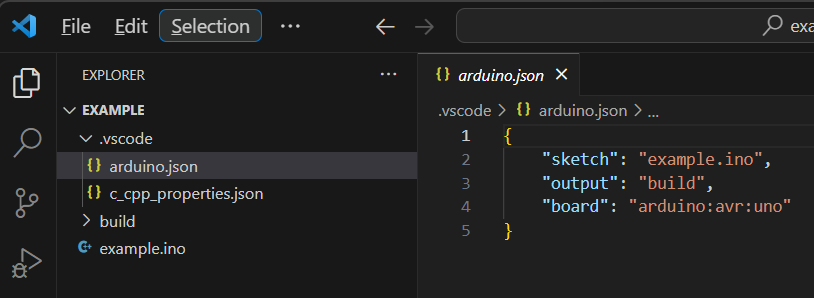

# Screen Menu With Navigation

## Quick Start

* Define enviromental variable HOME: C:\Users\<user>
* Install the extension: Arduino for Visual Studio Code
* Clone the repository

## Schematic

TBD

## Getting the automatic configuration (optional)

* Create a simple project to get the automatic configuration of the extension
* Press F1 -> Arduino: Initialize
* Select the name of the sketch and the target board
* Use the information in _c_cpp_properties.json_ to adapt the configuration

> **_NOTE:_** The sketch name must be the same as the folder project name.

esptool --chip esp8266 --port "COM4" --baud "921600" --before default_reset --after hard_reset write_flash 0x0 "c:\Users\jlnbo\Repos\esp8266\app01\build/app01.ino.bin" 
esptool.py v3.0